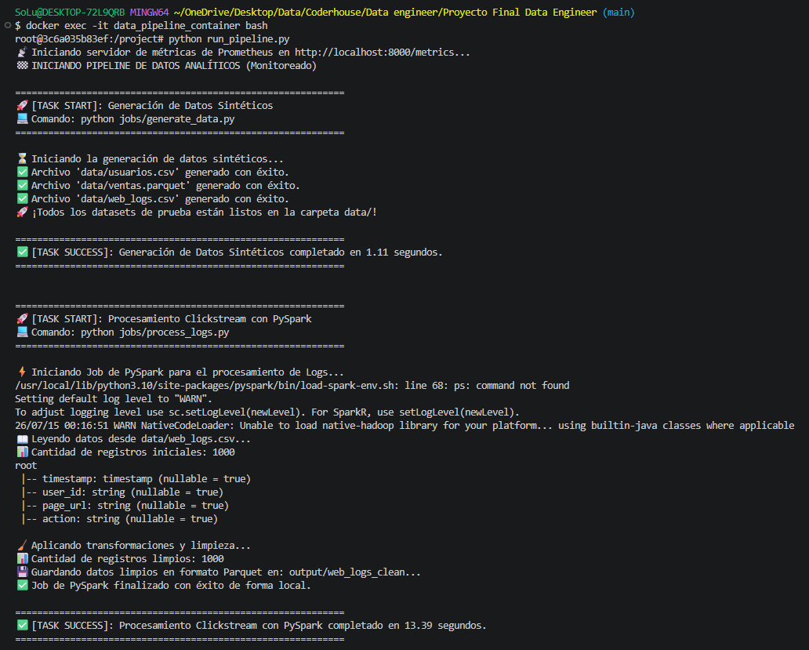
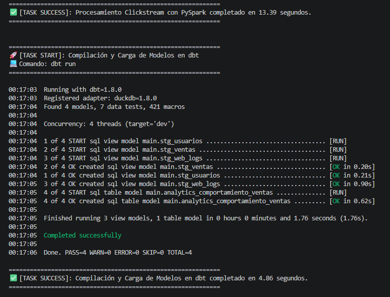
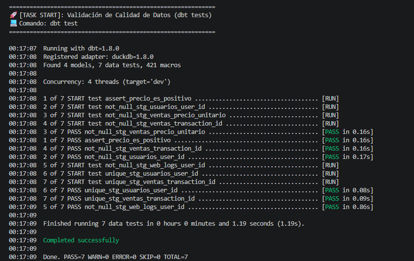
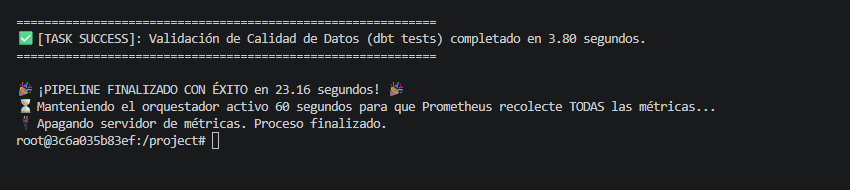
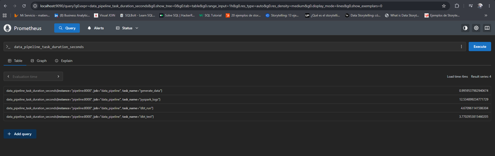
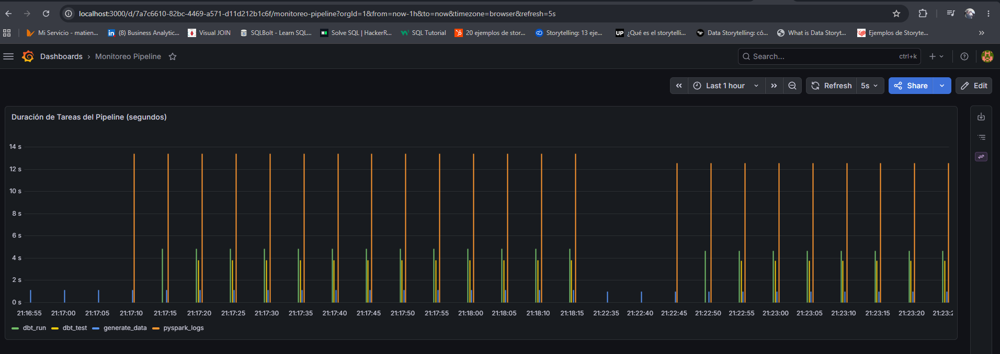

# Pipeline Batch de Ingeniería de Datos con PySpark, dbt y Observabilidad

Este proyecto consiste en el diseño e implementación de un pipeline de datos batch robusto, contenerizado y monitoreado bajo estándares de producción. El flujo extrae datos crudos, realiza procesamiento a gran escala con Apache Spark, aplica transformaciones y lógica de negocio en el Data Warehouse con dbt, y expone métricas de rendimiento en tiempo real utilizando Prometheus y Grafana.

---

## 📐 Arquitectura del Proyecto

El ecosistema está completamente automatizado y contenerizado utilizando **Docker**.

```text
[ Orquestador Python ] ──> Generación de Datos (Raw)
        │
        ├──> [ PySpark Container ] ──> Procesamiento y Limpieza (Data Lake)
        │
        ├──> [ dbt Container ] ──> Modelado y Carga (Data Warehouse / DuckDB)
        │
        └──> [ Prometheus / Grafana ] ──> Registro de Métricas y Visualización (Dashboard)
```

### Componentes Clave:
*   **Orquestador (Python):** Controla el flujo secuencial de ejecución de las tareas y expone un servidor de métricas en el puerto `8000`.
*   **Procesamiento (PySpark):** Limpia, estructura y procesa grandes volúmenes de datos optimizando el uso de memoria.
*   **Transformación (dbt):** Modela las tablas finales dentro del Data Warehouse y ejecuta pruebas de calidad (*data quality tests*).
*   **Almacenamiento (DuckDB):** Base de datos analítica columnar e "in-process" que actúa como Data Warehouse local, donde dbt materializa y transforma las tablas de forma ultra rápida.
*   **Observabilidad (Prometheus + Grafana):** Prometheus recolecta los tiempos de ejecución de cada tarea de manera activa, y Grafana los visualiza en un panel de control automatizado por código (*Dashboards-as-Code*).

---

## ⚡ Justificación Tecnológica: Enfoque "Future-Proof" con Apache Spark

Para la capa de procesamiento y enriquecimiento de datos se seleccionó **PySpark** por sobre herramientas tradicionales de análisis (como Pandas o consultas SQL directas en memoria), aplicando un **diseño de arquitectura proactivo y preparado para el futuro**. 

La decisión de estructurar el pipeline sobre Spark responde a la necesidad de **adelantarse al escalamiento del código ante volúmenes masivos de datos**, evitando costosas reingenierías a mediano plazo bajo los siguientes pilares:

1. **Escalabilidad Horizontal Anticipada (Big Data Ready):** Al implementar PySpark desde el inicio, el pipeline queda preparado para procesar Terabytes de información de forma nativa. Si el volumen de datos del negocio crece exponencialmente, **la lógica del código se mantiene exactamente igual**; solo se requiere acoplar más nodos al clúster de Spark, logrando un escalamiento lineal sin tocar una sola línea de lógica de datos.
2. **Desacoplamiento de Recursos de una Sola Máquina (In-Memory):** Herramientas tradicionales como Pandas están limitadas a un único hilo de ejecución y restringidas a la RAM de un solo servidor físico. PySpark nos permite distribuir el procesamiento en memoria a lo largo de un clúster de nodos, eliminando de raíz los cuellos de botella de hardware antes de que ocurran.
3. **Optimización Inteligente con Evaluación Perezosa (Lazy Evaluation):** Spark no ejecuta las operaciones de forma lineal inmediata. Construye un Grafo Acíclico Dirigido (DAG) para optimizar el plan de ejecución física. Esto garantiza que las transformaciones pesadas se agrupen y simplifiquen automáticamente para consumir el menor cómputo posible antes de persistir los resultados refinados en DuckDB, protegiendo la eficiencia del sistema.

---

## 🚀 Cómo Ejecutar el Proyecto (Paso a Paso)

Siga estas instrucciones para levantar el entorno local de manera limpia y automática:

### Prerrequisitos
*   Tener instalado [Docker Desktop](https://www.docker.com/products/docker-desktop/).
*   Tener instalado [Git](https://git-scm.com/).

### 1. Clonar el repositorio y levantar la infraestructura
Clone este repositorio en su máquina local y levante todos los servicios en segundo plano con un solo comando:

```bash
git clone https://github.com/FelixLamas/Proyecto_Final_Data_Engineer_Coderhouse
cd Proyecto_Final_Data_Engineer_Coderhouse
docker-compose up -d --build
```

### 2. Ejecutar el Pipeline de Datos
Ingrese al contenedor del pipeline y ejecute el script orquestador:

```bash
docker exec -it data_pipeline_container bash
python run_pipeline.py
```

*Nota: Al finalizar las tareas, el script mantendrá activo el servidor de métricas durante **60 segundos** para permitir que Prometheus recolecte de manera segura todos los tiempos de ejecución.*

---

## 📊 Monitoreo y Visualización

Tanto el origen de datos (*Data Source*) como el tablero de control de Grafana han sido configurados mediante **infraestructura como código (Provisioning)**, por lo que se configuran automáticamente al iniciar el proyecto.

### Acceso a las Interfaces Web:
*   **Prometheus:** [http://localhost:9090](http://localhost:9090)
*   **Grafana:** [http://localhost:3000](http://localhost:3000) (Credenciales: `admin` / `admin`).

### Visualizar el Dashboard:
1.  Inicie sesión en Grafana.
2.  Diríjase a la sección de **Dashboards** en el menú de la izquierda.
3.  Abra el tablero **"Monitoreo Pipeline"**.
4.  *Recomendación:* Ajuste el rango de tiempo en la esquina superior derecha a **"Last 5 minutes"** o **"Last 15 minutes"** para apreciar con precisión las barras de la corrida actual del pipeline.

---

## 📷 Evidencias de Ejecución

### 1. Ejecución del Pipeline (Consola)





### 2. Consulta en Prometheus (`data_pipeline_task_duration_seconds`)


### 3. Dashboard en Grafana


---

## 👥 Autor
*   **Felix Eloy Lamas** - *Data Engineer*